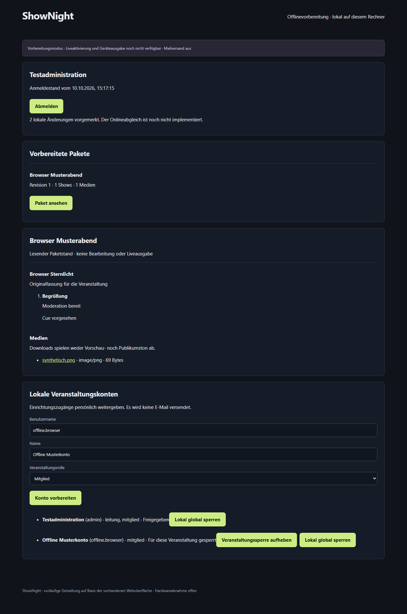

# S3-02 · Lokaler HTTPS-Server und Offlinekonten

Ergänzung S3-03 vom 10. Oktober 2026: [gezielte LAN-Neueinrichtung](s3-lan.md) ist als weiteres Softwarepaket implementiert. Der nachfolgende Ablauf beschreibt unverändert die Loopback-Einrichtung; echte Mehrgeräteprüfung und Umstellung bestehender Profile bleiben offen. Zusätzliche Startdateien im Server-ZIP: Server-LAN-Einrichten.cmd und Server-Netzwerk-Pruefen.cmd. Keine automatische Firewall-/Vertrauensinstallation.

Stand: 2026-10-10 · Softwaregrundlage lokal geprüft, GitHub-Prüfstand siehe Status. Kein Netcup-Update und keine Veranstaltungsfreigabe.

## Bedienbarer Ablauf

Voraussetzungen: Windows x64, ein eigener Windows-Benutzer und vorbereitete Pakete aus S3-01. Die kostenlose Node-24-Laufzeit ist im portablen Paket enthalten. Windows DPAPI und die Windows-Zertifikatswerkzeuge werden verwendet. Es werden keine Firewallregeln und keine systemweiten Zertifikate geändert.

1. Nach pnpm build und pnpm server:package das ZIP dist/shownight-server-windows-x64.zip entpacken. Server-Einrichten.cmd ausführen. Die Einrichtung legt Schlüssel und SQLite-Konten unter %LOCALAPPDATA%\ShowNight\local-server ab. Der private Zielschlüssel und die Verschlüsselungsschlüssel liegen in server.dpapi, für den aktuellen Windows-Benutzer geschützt. Das PFX hat ein zufälliges, ebenfalls DPAPI-geschütztes Kennwort. Das Verzeichnis hat ausschließlich Rechte für diesen Benutzer und SYSTEM.
2. Den separaten Wiederherstellungsschlüssel aus %LOCALAPPDATA%\ShowNight\secrets\local-server-recovery.env persönlich sichern. Die Datei gehört nicht in Git, OneDrive, Chat oder das Downloadpaket. Admin-UUID und neues Kennwort bleiben zunächst leer.
3. Die Datei server.sntarget enthält nur die Zielkennung und den öffentlichen RSA-Schlüssel. Auf dem Online-Server als Admin mit MFA anmelden, ein gültiges Paketmanifest erzeugen und das Inhaltspaket herunterladen. Im Paketbereich die Zielanfrage auswählen; Serverschlüssel .sntrust und verschlüsselten Anmeldestand .snauth herunterladen.
4. Das Inhaltspaket mit der S3-01-Paketablage importieren. Serverschluessel-Importieren.cmd starten und die aus der angemeldeten HTTPS-Verbindung heruntergeladene .sntrust auswählen. Serveradresse und Fingerabdruck prüfen. Dieses ausdrückliche Vertrauen ist Voraussetzung; die Anmeldedatei darf keinen eigenen vertrauenswürdigen Schlüssel mitbringen.
5. Anmeldestand-Importieren.cmd starten und die .snauth auswählen. Fehlende, beschädigte, abweichende Pakete, falsches Ziel, falscher Serverschlüssel und veraltete Exporte werden abgewiesen. Ein neuer Import beendet bestehende lokale Sitzungen.
6. server.cer unter %LOCALAPPDATA%\ShowNight\local-server über den Windows-Zertifikatsimport **für den aktuellen Benutzer** als vertrauenswürdige Stammzertifizierungsstelle importieren, nachdem Quelle und Fingerabdruck persönlich geprüft wurden. Das ist eine bewusste Bedienhandlung; ShowNight installiert kein Vertrauen automatisch. Das selbstsignierte Zertifikat gilt ein Jahr für localhost und die Loopback-Adressen. Bei Ablauf ist eine gesonderte Zertifikatserneuerung erforderlich; HTTPS-Prüfung nicht abschalten.
7. Server-Start.cmd ausführen, dann https://localhost:3443 öffnen. Der Dienst bindet ausschließlich 127.0.0.1. Zum Beenden im Startfenster Strg+C verwenden. Andere PCs erreichen diesen Stand noch nicht; LAN-Einrichtung ist offen.
8. Mit dem Kennwort aus dem exportierten Online-Anmeldestand anmelden. Admin und Leitung brauchen MFA. Vorhandene Authenticator-Schlüssel gelten auch offline; die Replayzähler und Recoverycodes sind jedoch getrennt. Bei der ersten erfolgreichen Offline-MFA werden acht lokale Recoverycodes einmalig angezeigt. Persönlich sichern. Ein verbrauchter Code wird durch denselben Quellstand nicht wieder freigegeben.

## Konten, Rechte und Wiederherstellung

Admin-Konten-Anzeigen.cmd zeigt lokal Kontokennung, Benutzername und Sperrstatus vorbereiteter Admins, ohne Anmeldegeheimnisse. Damit lässt sich die für die physische Wiederherstellung benötigte UUID vor Ort ermitteln, auch bei gestopptem Webserver.

Pakete sind lesend verfügbar; Veranstaltungskonten erhalten ausschließlich ihre vorbereiteten Veranstaltungsrechte. Zuweisungen zu Shows werden mitgeführt, es gibt hier noch keinen Editor. Admin und zuständige Leitung können lokale Veranstaltungskonten anlegen und einen 24 Stunden gültigen Einrichtungscode persönlich übergeben. Es wird keine Mail gesendet. Neue Leitungen richten lokale MFA ein. Leitung darf keine globalen Admins sperren. Veranstaltungssperren und globale lokale Adminsperren bleiben beim nächsten Quellenimport erhalten.

Lokale Änderungen werden in einer SQLite-Auditwarteschlange als noch abzugleichen vorgemerkt. Das ist **kein implementierter Onlineabgleich**. Neue lokale Konten bleiben bei einem Import erhalten. Ein Refresh ersetzt die mitgebrachten Onlinezuweisungen und deaktiviert im neuen Export nicht mehr enthaltene Quellkonten.

Für die physische administrative Wiederherstellung: Server stoppen. In der lokalen Recoverydatei LOCAL_RECOVERY_USER mit der UUID eines im aktuellen Anmeldestand aktivierten Admins und LOCAL_RECOVERY_PASSWORD mit einem neuen Kennwort von mindestens zwölf Zeichen füllen. Admin-Wiederherstellen.cmd ausführen. Danach das Datei-Kennwort leeren. Die nächste Anmeldung richtet lokale MFA neu ein. Der Weg kann einen im Quellstand deaktivierten Admin nicht reaktivieren.

Ein unverändert erneut exportiertes Onlinekennwort beziehungsweise ein unveränderter Online-MFA-Schlüssel überschreibt die lokale administrative Wiederherstellung nicht. Eine tatsächliche Kennwort-/MFA-Änderung auf dem Online-Server übernimmt beim nächsten Import den neuen Quellwert. Lokale Wiederherstellungen sind im Audit zum späteren Abgleich vorgemerkt; eine automatische Konfliktlösung ist noch nicht vorhanden.

Eine Sicherung muss bei gestopptem Server die vollständigen Verzeichnisse local-server und local-packages sowie den separat gesicherten Recovery-Schlüssel umfassen. DPAPI-Dateien funktionieren nur im ursprünglichen Windows-Benutzerprofil; der Recoverycode ersetzt keinen verlorenen DPAPI-Schlüssel. Wiederherstellung auf einem anderen Rechner und automatische Sicherungsverwaltung sind offen.

## Format und Schutz

.snauth ist ein strikt begrenzter, Ed25519-signierter Umschlag mit AES-256-GCM-Inhalt und RSA-OAEP-SHA256-Schlüsseltransport an einen mindestens 3072 Bit starken Zielschlüssel. Der Serversignaturschlüssel wird mittels HKDF mit eigenem Zweck aus dem bestehenden Server-MFA-Schlüssel abgeleitet. Ein Schlüsselwechsel erfordert eine ausdrücklich geprüfte neue Vertrauenskonfiguration.

Enthalten sind ausschließlich relevante interne Identitäten, Passwortableitungen, aktuelle MFA-Schlüssel, Veranstaltungsrollen und Paketbindungen. Online-Recoverycodes, Sitzungen, MFA-Zähler, Agentenzugangsdaten und der Server-Masterschlüssel werden nicht exportiert. Die normal herunterladbaren .snpkg bleiben ohne Anmeldedaten.

Anmeldestände haben eine monotone Online-Exportfolge; Rückspielung älterer Exporte ist untersagt. Paketbindungen enthalten die Prüfsumme des kanonischen Manifests. HTTPS, Secure-/HttpOnly-/SameSite-Cookies, Origin- und CSRF-Prüfung, begrenzte Anmeldung/MFA-Versuche und erneute Rechteprüfung schützen die lokale Weboberfläche. Medien werden vor der Auslieferung gegen die gepinnte Prüfsumme geprüft. Es wird kein Medienverzeichnis öffentlich freigegeben.

Die Online-API erhält additive Migration 003 (Exportfolge ohne Geheimnisse). Bestehender produktiver S2-Stand bleibt unverändert, bis ein gesondertes geprüftes Update durchgeführt wird.

## Grenzen und Prüfungen

Der Screenshot stammt aus dem Browser-Vertragstest mit künstlichen Konten. Vor der Aufnahme wurden MFA-/Recovery-/Einrichtungscodes ausgeblendet. Kein realer Veranstaltungs-/Hardwarebetrieb.

Ausführbare Befehle: pnpm typecheck, pnpm build, pnpm test:offline, pnpm server:package. Lokal: Typprüfung/Build, Windows-ZIP und Offline 9/9 (acht Prüfgruppen plus Elternfall) bestanden; Browserablauf und S1-/S2-/Paketregressionen ebenfalls bestanden. Aktualisierte Nachweise mit GitHub-Prüfstand stehen in [Status](status.md) und [Protokoll](protokoll.md). Browser-Vertragstest verwendet synthetisches localhost-HTTP; separate native Windows-PFX-Prüfung bestätigt HTTPS mit vollständiger CA-/Hostnameprüfung, ohne automatische Vertrauensinstallation.

Globale Admins behalten wie online Systemzugriff und werden ausschließlich global lokal gesperrt. Eine Veranstaltungssperre für einen globalen Admin wäre wirkungslos und wird daher abgewiesen.

Noch offen: LAN mit mehreren Geräten, automatischer Onlineabgleich, Paketaktivierung, vollständige lokale Fachmodule, Windows-Renderer, HDMI, GO, Tonwege, Hardware-/Veranstaltungsabnahme und automatische Zertifikatserneuerung. Das Lesen einer Show und Mediendownload sind kein Nachweis einer Bühnenausgabe. Vollständiger Umfang F01–F50/A01–A30 bleibt Ziel.

Technische Primärquellen: [Node 24 Crypto](https://nodejs.org/download/release/v24.19.0/docs/api/crypto.html), [Windows-Zertifikatserstellung](https://learn.microsoft.com/en-us/powershell/module/pki/new-selfsignedcertificate), [PFX-Export](https://learn.microsoft.com/en-us/powershell/module/pki/export-pfxcertificate).
